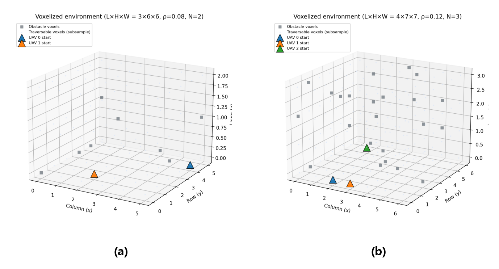
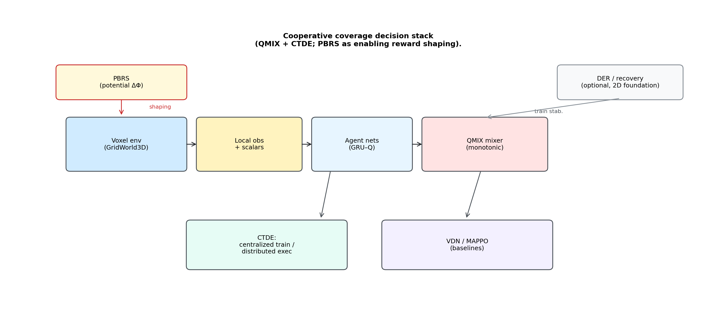
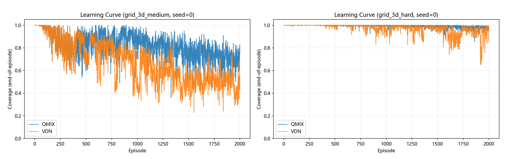
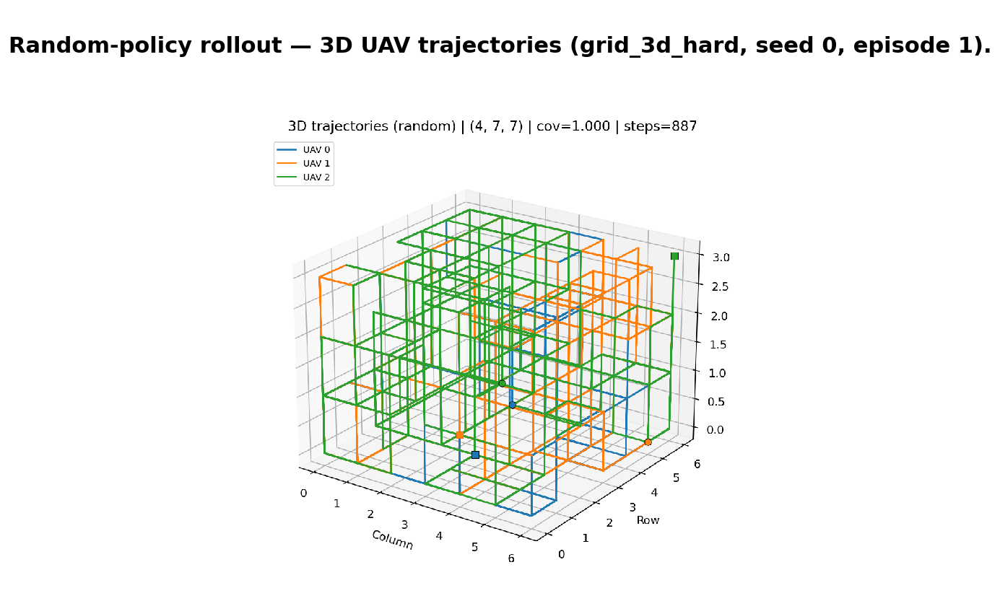
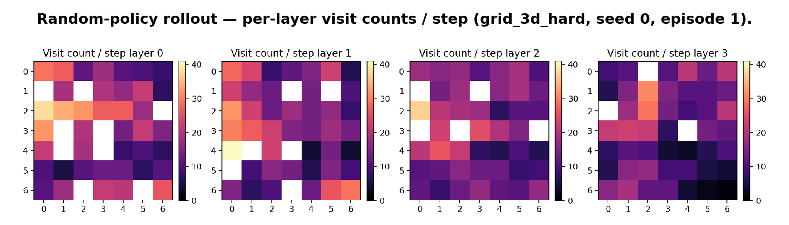
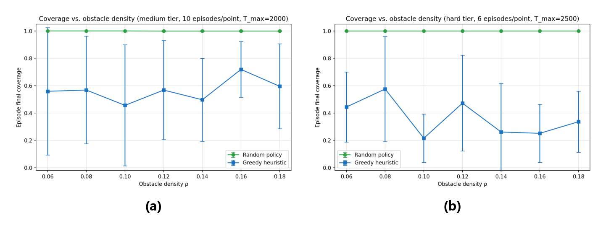
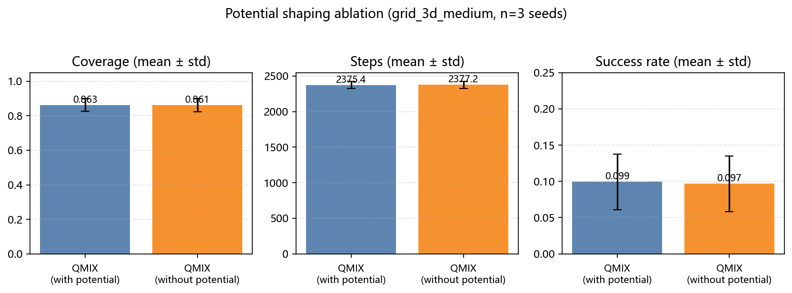

# 基于QMIX的多无人机三维协同覆盖方法

## 摘要

针对复杂三维空间下的多无人机协同覆盖路径规划（CPP）问题，传统几何分解与启发式方法在三维体素场景中的环境表征与多机协同决策效率方面仍存在不足。

本文构建基于三维体素的 GridWorld3DEnv 仿真基准，将多机协同覆盖任务建模为去中心化部分可观测马尔可夫过程（Dec-POMDP）。在集中式训练–分布式执行（CTDE）框架下，提出一种结合 QMIX 价值分解与势能奖励塑形（PBRS）的协同控制方法：QMIX 通过单调混合网络拟合联合动作价值，以应对多机组合动作空间爆炸；PBRS 以势差项与环境中碰撞规避、新区域探索等事件奖励协同，在无显式机间通信条件下为覆盖与避障提供逐步引导。

在 **Medium 档**（$3\times6\times6$）与 **Hard 档**（$4\times7\times7$）场景下开展实验（学习类方法各档训练 2000 episodes；以 VDN、MAPPO 为学习类对照，Greedy/Random 无训练，仅作说明性基线）。Hard 档结果表明，QMIX 的 coverage mean 约为 0.993、success mean 约为 0.601，高于 VDN 与 MAPPO，且 steps mean 跨种子波动更小；Medium 档 success mean 仍约 0.10，终止式全覆盖具挑战。消融表明 PBRS 对 coverage mean 提升有限，但对 success mean 与早期探索有边际辅助。本文提供可复现的三维 MARL 协同覆盖基准与实现，供后续对比与 Sim-to-Real 研究参考。

**关键字：** 多智能体强化学习；覆盖路径规划；价值分解模型；势能奖励塑形；三维环境仿真

## 第1章 引言

覆盖路径规划（Coverage Path Planning, CPP）要求多架无人机在障碍环境中规划轨迹，以尽可能完整地覆盖目标区域，是区域搜索、环境监测与灾害救援等任务的基础。在复杂三维场景中，障碍分布随机、空间拓扑碎片化，传统基于几何分解或短视启发式的算法[1]往往难以同时兼顾全局覆盖效率与多机协同性。

将学习型方法用于三维多机协同覆盖时，在体素栅格等离散环境表征下，还面临一系列共性难题：离散机动下联合动作空间规模为 $|\mathcal{A}|^N$（$N$ 为智能体数量），随智能体数量增加呈指数级增长；体素状态维度高，策略表征与信用分配难度大；覆盖回报稀疏，早期探索易陷入局部最优。上述问题共同制约了多无人机在三维栅格中的稳定收敛与可部署协同。

多智能体强化学习（MARL）[2]为分布式协同覆盖提供了基于策略学习的决策框架。在典型部署中，各机受通信与接口约束，需依据环境反馈独立输出动作，问题可表述为去中心化部分可观测马尔可夫决策过程（Dec-POMDP）[3][4]。集中式训练–分布式执行（CTDE）[5][6]通过在训练阶段利用全局信息、在执行阶段保留分布式策略接口，成为缓解非平稳性与协同学习难度的常用范式。

在 CTDE 下，价值分解方法通过构造全局联合价值 $Q_{\mathrm{tot}}$ 与个体 $Q_i$ 之间的映射以分配协同信用。VDN[7] 采用线性可加分解，结构简洁但对复杂机间交互的刻画能力有限；QMIX[8] 在单调性约束下以混合网络实现**非线性联合价值拟合**，可更灵活地表达多机协同，同时保持分布式执行时 greedy 解码的一致性。与之对照，基于策略梯度的多智能体 Actor–Critic 方法（如 MAPPO[9]）在连续控制中应用广泛，但在长视界、高维离散动作覆盖任务中，方差控制与样本效率仍是需要关注的问题。

覆盖任务中，除回合级完成信号外，往往还需逐步引导以加速探索。势能奖励塑形（Potential-Based Reward Shaping, PBRS）[10] 通过势函数差分提供稠密反馈；在单智能体 MDP 下，经典 PBRS 可在一定条件下保持最优策略不变性，在多智能体团队回报设定中则常作为工程近似，用于改善早期定向探索并辅助信用传播。

针对上述背景，本文在三维体素仿真基准 `GridWorld3DEnv` 上，提出结合 QMIX 价值分解与 PBRS 的多无人机协同覆盖方法。工程实现中，各智能体接收共享的**全局体素观测向量**：已访问（Visited）、障碍（Obstacle）、UAV 占用（`uav_layer`，多机位置的联合栅格标记），以及覆盖率、各机归一化位置与能量等标量；训练时对同一观测进行 `np.tile` 复制输入，无显式机间通信，但各机通过独立策略接口输出动作。训练阶段在 CTDE[5][6] 架构下以 QMIX[8] 单调混合网络将全局 TD 目标映射至个体 $Q_i$；奖励方面，PBRS[10] 势差项与重访惩罚、碰撞与障碍接触等事件奖励解耦叠加，共同构成逐步回报。

实验在 **Medium 档**（$3\times6\times6$、$N=2$、$\rho=0.08$）与 **Hard 档**（$4\times7\times7$、$N=3$、$\rho=0.12$）下开展，目的分别为：（1）在 Medium 档观察训练收敛并开展与 VDN、MAPPO、Greedy、Random 等的基线对比；（2）在 Hard 档检验更大规模与更高障碍密度下的多机协同覆盖效果及 QMIX 相对 VDN、MAPPO 的优劣；（3）通过 PBRS 开/关消融量化 PBRS 塑形对成功终止与早期探索的边际贡献。

本文的主要贡献总结如下：
1. 构建了面向三维协同覆盖的离散体素仿真基准（`GridWorld3DEnv`），刻画多无人机在固定障碍密度下的状态转移、全局体素观测向量与分层奖励机制，并给出 **Medium 档 / Hard 档** 可复现配置。
2. 设计了 QMIX 非线性价值分解与 PBRS 相结合的协同架构，明确势差引导与事件惩罚的协同关系，在无显式通信条件下实现可部署的分布式决策。
3. 在上述两档场景完成系统对比与消融，为三维体素多机覆盖中的价值分解选型与奖励塑形设计提供实证参考。

## 第2章 相关工作

### 2.1 覆盖路径规划与三维环境表征

覆盖路径规划（Coverage Path Planning, CPP）旨在为移动平台生成一条轨迹，在避免障碍物的同时完全覆盖目标区域。在二维平面场景中，已有研究提出基于几何分解（如牛耕法）、生成树覆盖与启发式优化等方法[1]，在规则区域内具有较高执行效率。然而，随着应用场景向城市空中交通（UAM）、室内巡检等三维空间扩展，传统二维 CPP 难以直接适配高度受限及拓扑碎片化立体空间。

在三维环境表征方面，**体素地图（voxel map）**[11]——即对空间进行均匀剖分后的离散体素单元集合——因其规则性与对障碍、可通行区域的可编码性，成为强化学习与机器人仿真中常用的环境表示形式。相较于连续位姿控制，体素地图将状态组织为规则三维栅格，可进一步堆叠为已访问、障碍、占用等多通道张量，便于神经网络提取空间特征。体素化可能引入离散化误差，但通常能显著降低环境推理复杂度。现有工作多关注静态障碍下的覆盖效率；在障碍密度升高（文献中常见 $\rho$ 取 $10\%$–$30\%$ 乃至更高[12]；**本文主实验取 $\rho=0.08$、$0.12$**）或通道碎片化的三维体素地图中，纯几何/启发式规划的开销与多机协同难度进一步上升，促使研究者转向学习型覆盖策略[13][14]。

上述体素地图解决的是「环境如何表示」；要在该表示上实现多机协同覆盖，还需与之匹配的决策与学习框架，下文从多智能体强化学习入手讨论。

### 2.2 多智能体强化学习与协同决策

MARL[2]通过智能体间交互学习协同策略，适用于分布式覆盖任务。在 Dec-POMDP[3][4] 表述下，CTDE 范式[5][6]通过在训练阶段利用全局信息、执行阶段保持分布式策略接口，成为缓解非平稳性与信用分配问题的常用途径。

在 CTDE 架构中，价值分解（Value Decomposition）将全局联合价值 $Q_{\mathrm{tot}}$ 与个体 $Q_i$ 建立映射。VDN[7] 与 QMIX[8] 分别采用线性与单调非线性分解，后者可表达更丰富的机间协同关系并支持分布式 greedy 解码，与本文主方法选型一致。

**观测设定**是连接体素地图与策略网络的接口，需与后文方法章保持一致。本文采用如下术语：

- **局部窗感知（local-window perception）**：各智能体仅观测以自身为中心的固定邻域体素/状态，信息局部，常需通信补全全局态势。
- **全局体素观测向量（global voxel observation vector）**：将全图（或全仿真域）的体素通道（如已访问、障碍、UAV 占用等）编码为固定维向量；本文 `GridWorld3DEnv` 在训练时对同一向量复制至各智能体输入（见第3章），执行阶段各机仍独立出动作，但**不**属于狭义局部窗感知。

经典 MARL 工作多基于局部窗感知[6][15]；本文面向覆盖协同，在仿真中采用**全局体素观测向量**以突出多机分工与障碍规避，其挑战在于从高维全局编码中提取有效协同特征并应对 $|\mathcal{A}|^N$ 的组合动作空间。

在已确定体素环境表示与 CTDE–价值分解框架之后，覆盖任务仍受稀疏回报制约：仅依赖回合末完成信号难以稳定训练，因此需结合奖励塑形与事件型分项奖励，见下节。

### 2.3 奖励塑形与稀疏探索机制

在覆盖路径规划等长视界（long-horizon）任务中，仅依赖任务完成时的稀疏奖励往往导致策略收敛缓慢或陷入局部最优。势能奖励塑形（Potential-Based Reward Shaping, PBRS）[10] 通过势函数差分在每一步提供与几何结构相关的稠密反馈；Ng 等人[10] 在单智能体 MDP 中证明了合理 PBRS 在一定条件下可保持最优策略不变性。多智能体团队回报下严格不变性难以完全成立，但基于未访问距离、障碍 clearance 等的势差项仍被广泛用作工程近似[16][17]，以改善早期探索。

除 PBRS 外，**分层奖励设计**[18][19]常配合体素地图中的状态转移直接施加事件奖励（event-based penalties），与势差项解耦，包括：障碍/边界接触代价、重访惩罚、机间碰撞惩罚及新格覆盖激励等。PBRS 提供「朝未覆盖区域推进」的连续引导，事件奖励刻画硬约束与覆盖进度；二者结合有助于在三维体素地图上缓解早期随机游走，为第3章的分层奖励实现提供依据。

### 2.4 现有局限性与本文切入点

尽管 MARL 在游戏和仿真中取得了显著进展，但在三维体素 CPP 领域仍面临以下局限：

1. **三维空间探索效率低**：大量工作仍侧重二维平面，针对三维体素地图碎片化与垂直机动的协同探索机制相对不足；
2. **协同与长视界探索的张力**：多机覆盖易重叠访问，在无显式通信下难以平衡局部贪心与全局分工；
3. **奖励与几何脱节**：稀疏完成信号与通用 PBRS 难以充分利用体素地图中的距离与障碍结构，精细引导不足。

针对上述不足，本文在第3章给出统一方案：在自研体素地图环境 `GridWorld3DEnv` 上，采用**全局体素观测向量**与 CTDE 下的 QMIX 非线性价值分解，并引入与未访问 BFS 距离及障碍势相关的 PBRS，与重访、碰撞等事件奖励分层叠加；在 Medium/Hard 两档体素地图配置下与 VDN、MAPPO 等基线对比，并通过 PBRS 消融检验塑形边际贡献（实验见第4章）。

## 第3章 方法

### 3.1 三维体素环境建模与 Dec-POMDP 描述

本文将三维覆盖路径规划问题建模为离散栅格空间下的多智能体探索任务。与传统的连续坐标或二维网格基准不同，本文在自研**体素地图（voxel map）**仿真环境 `GridWorld3DEnv` 上进行实验：以规则体素栅格替代连续位姿控制，便于覆盖率统计与碰撞检测，并保留三维空间中的高度遮挡与垂直机动特性。

环境地图定义为离散集合 $\mathcal{G} = \{ (x, y, z) \mid x \in [0, W), y \in [0, H), z \in [0, L) \}$，其中 $W, H, L$ 分别为环境在长、宽、高三个维度的体素网格数（与实现中 `map_shape = (L, H, W)` 的层数、行数、列数一致）。每个体素单元在逻辑上可区分为：障碍物、可通行已访问、可通行未访问。环境初始化时，按照预设的障碍密度 $\rho$ 随机撒布静态障碍物，在单个回合（episode）内障碍分布保持固定，以此验证算法在不同分布下的泛化能力。

基于上述体素地图，覆盖任务形式化为 Dec-POMDP[3][4]，由元组 $\langle \mathcal{S}, \mathcal{O}, \mathcal{A}, R, P, \gamma, N \rangle$ 定义，其中：$\mathcal{S}$ 为联合状态空间（完整三维栅格及访问标记等）；$\mathcal{O}$ 为各智能体观测空间；$\mathcal{A}$ 为个体离散动作空间；$R$ 为（可分解的）团队逐步回报；$P$ 为环境转移核；$\gamma \in [0,1)$ 为折扣因子；$N$ 为 UAV 数量。在每个时间步 $t$，联合状态 $s_t \in \mathcal{S}$，智能体 $i$ 接收 $o^i_t \in \mathcal{O}$ 并输出 $a^i_t \in \mathcal{A}$。本文将 $\mathcal{A}$ 定义为沿 $X,Y,Z$ 三轴正负方向的六邻域机动（$|\mathcal{A}|=6$），联合动作空间规模为 $|\mathcal{A}|^N$。工程上各机输入为**相同的全局体素观测向量**（见3.2节），Dec-POMDP 在此强调**分布式执行接口**（各机独立出动作、无显式机间通信），而非严格信息论意义上的局部窗感知。

如表 1 所示，实验采用 Medium 与 Hard 两档基准；Hard 档在体素规模、障碍密度 $\rho$、智能体数 $N$ 及步数/能量上限上均高于 Medium，对应更碎片化三维体素地图与更大的 $|\mathcal{A}|^N$（环境示意见图 1）。

**表 1** Medium 与 Hard 基准环境参数

| 配置 | 栅格尺寸 $L\times H\times W$ | $\rho$ | $N$ | $T_{\max}$ | 能量预算 |
|------|---------------------------|--------|-----|------------|----------|
| Medium | $3\times6\times6$ | 0.08 | 2 | 2500 | 4500 |
| Hard | $4\times7\times7$ | 0.12 | 3 | 3500 | 6000 |

- **Medium 配置**：对应 `configs/envs/grid_3d_medium.yaml`，作为中等难度的收敛性与基线对比基准。
- **Hard 配置**：对应 `configs/envs/grid_3d_hard.yaml`，空间体素数与障碍碎片化程度更高，对多机长程规划与避障协同提出更高要求。
- **回合终止**：当所有可通行体素均被访问时 `terminated`；当步数达到表 1 所列最大步数或全部 UAV 能量耗尽时 `truncated`。

Medium 档规模适中，侧重训练收敛与多基线公平对比；Hard 档作为检验长程协同与价值分解能力的主难度档位。

*图 1 （**a**）**Medium 档**（$3\times6\times6$，$\rho=0.08$，$N=2$）：灰—障碍，浅色—可通行（子采样），彩标—UAV 初始位置；（**b**）**Hard 档**（$4\times7\times7$，$\rho=0.12$，$N=3$）。*

如图 1 所示，两档场景均在三维体素栅格中随机分布静态障碍（灰色方块），可通行区域以子采样点示意（浅色点），彩色标记为各 UAV 初始位置。Medium 档地图较紧凑、$\rho$ 较低，便于观察双机条件下的覆盖扩展与训练稳定性；Hard 档层数与平面尺寸更大、障碍更密且为三机协同，垂直方向的分层结构在图 1（**b**）中更为突出，与表 1 中更高的步数与能量上限相一致，用于考察碎片化三维空间中的避障与分工覆盖能力。

### 3.2 基于 CTDE 与 QMIX 的协同控制架构

针对联合动作空间 $|\mathcal{A}|^N$ 带来的协同学习难度，本文在 **CTDE**[5][6] 框架下采用单调价值分解算法 **QMIX**[8] 学习；环境动力学与奖励定义见3.1、3.3节。

**全局体素观测向量。** 环境经 `_get_observation` 返回固定维向量，由三路体素通道与若干标量拼接而成：已访问（Visited）、障碍（Obstacle）、UAV 占用（`uav_layer`，在格点上标记是否存在无人机，为多机联合栅格编码）。标量项包括覆盖率、各机归一化位置与能量等。训练时对同一向量做 `np.tile` 复制至各智能体，故各机输入维度与内容一致；执行阶段仍由各自的 **门控循环单元 Q 网络**（Gated Recurrent Unit Q-network，**GRU–Q**）独立解码动作，满足无显式机间通信的部署约束。

**QMIX 价值分解。** 设 $N$ 个 GRU–Q 网络输出 $Q_i(o^i_t, h^i_{t-1}, \cdot)$。训练阶段，混合网络（Mixing Network）以全局状态 $s_t$（与观测同维特征）为条件，经超网络生成非负权重 $w_i(s_t)\geq 0$，满足单调性：

$$\frac{\partial Q_{\mathrm{tot}}}{\partial Q_i} = w_i \geq 0$$

从而在**时序差分**（Temporal Difference，**TD**）目标下学习非线性联合价值，执行时各 UAV 仅运行本地 GRU–Q 网络 greedy 解码。

*图 2 主实验 **QMIX+PBRS** 栈（CTDE；DER/recovery 未启用）。*

如图 2 所示，体素地图环境每步输出事件惩罚与 **势能奖励塑形**（Potential-Based Reward Shaping，**PBRS**）[10] 势差（式(1)–(3)）；训练端聚合 $Q_i$ 构成 **TD 损失**（TD loss）目标。主实验不含 DER/recovery；消融仅关闭 PBRS（3.4节）。

### 3.3 奖励塑形与事件惩罚机制

三维全覆盖为长视界目标：除回合末 $r_{\mathrm{complete}}$ 外，仍需逐步信号缓解稀疏性。本文采用 **势能奖励塑形**（Potential-Based Reward Shaping，**PBRS**）[10] 与**事件惩罚**（event penalty）分层叠加；经典 PBRS[10] 在单智能体 MDP 下可保持最优策略不变性，在团队回报设定中作为工程近似。

每步团队回报写为

$$r_t = r^{\mathrm{event}}_t + r^{\mathrm{PBRS}}_t \tag{1}$$

**事件惩罚与覆盖激励**（$r^{\mathrm{event}}_t$）：与势函数无关，直接编码约束与进度——障碍/边界接触 $r_{\mathrm{obstacle}}$、机间碰撞 $r_{\mathrm{collision}}$、重访 $r_{\mathrm{visited}}$、新格覆盖奖励（随剩余未访问格数缩放）、无进展惩罚（`reward_no_progress`）、全覆盖时均摊 $r_{\mathrm{complete}}$。消融 PBRS 时仅保留 $r^{\mathrm{event}}_t$（`enable_potential_reward: false`）。

**PBRS 势差项**（$r^{\mathrm{PBRS}}_t$）：经典形式[10]为

$$F_t = \gamma \Phi(s_{t+1}) - \Phi(s_t) \tag{2}$$

实现中势函数 $\Phi$ 由到最近未访问可通行体素的 BFS 距离（取负）与障碍 clearance 截断项构成，并采用工程近似

$$r^{\mathrm{PBRS}}_t = w_s \bigl(\Phi_{t+1} - \Phi_t\bigr) \tag{3}$$

其中 $w_s$ 为 `shaping_weight`。式(3) 未在势差内显式乘 $\gamma$，与式(2) 在形式上略有差异，属**工程实现折中**：仍按未访问距离与障碍 clearance 提供逐步导向，**不改变“朝未覆盖区域推进”的策略引导意图**；与经典 PBRS[10] 的严格最优性保证无一对一对应，但便于与事件惩罚联合调参。当 $\Delta\Phi>0$ 时施加正反馈。第4.5节消融通过置零 $w_s$ 检验式(3) 的边际贡献。

### 3.4 训练流程与评估设置

**训练与评估协议（公平性说明）。** 为便于区分「是否经过学习」与「评估口径是否一致」，本文约定如下。**学习类**方法中，QMIX 与 VDN 在 **Medium 档 / Hard 档各训练 2000 episodes**（配置见 `qmix_paper.yaml`、`vdn.yaml`），独立评估由 `eval_3d.py` 以 $\epsilon=0$ 贪心执行；MAPPO 在各档 **num_updates=2000**（`mappo.yaml`），独立评估由 `eval_mappo_3d.py --stochastic` 随机采样。**说明性启发式** Greedy、Random **不进行训练**，仅在 `eval_heuristic_3d.py` 中直接 rollout。主方法对比以**学习类方法之间**为主；Greedy/Random 仅作说明性基线（第4.3.2节），**不用于方法优劣判断**。指标命名与统计口径以第4.1.2节为准（episode 末覆盖率、coverage mean / success mean / steps mean，均值 $\pm$ 样本标准差）。

训练与评估基于 PyTorch 与 YAML 配置（QMIX/VDN 主配置见 `configs/algos/qmix_paper.yaml`、`vdn.yaml`）。**数据采集**：每个训练 episode 在 `GridWorld3DEnv` 中自初始状态 rollout 至 `terminated`/`truncated`，按 $\epsilon$-greedy 选动作，将整段轨迹（观测、动作、奖励、全局状态、终止标记）写入经验回放池（Replay Buffer）。**参数更新**：当缓冲条目数 $\geq$ `min_buffer`（400）后，每完成一个 episode 从池中随机采样 `batch_size=16` 条轨迹，计算 QMIX（或 VDN）的 **时序差分损失**（Temporal Difference loss，**TD loss**） 并经 **RMSprop**（学习率 $5\times10^{-4}$）更新 GRU–Q 与混合网络；目标网络每累计 200 次梯度步同步一次；折扣 $\gamma=0.99$；沿时间反向传播时每 64 步对 RNN 隐状态 detach（`bptt_detach_interval=64`）。**训练规模（学习类）**：**Medium 档与 Hard 档均训练 2000 个 episode**（QMIX/VDN）；探索率从 1.0 按因子 0.998 衰减至下限 0.05；回放容量 6000 条 episode。MAPPO[9] 采用 `rollout_steps=2048`、`num_updates=2000`，更新轮数与 2000-episode 量级对齐，但为 on-policy 采样。**Greedy/Random 无训练阶段**，仅在评估阶段 rollout（见本节「训练与评估协议」）。

**独立评估**：QMIX/VDN 在 `eval_3d.py` 中以 $\epsilon=0$ 贪心执行；MAPPO 按 `eval_mappo_3d.py` 随机采样；Greedy/Random 见 `eval_heuristic_3d.py`。各档 $n=3$ 个随机种子、每种子 **50 个 episodes**，汇报 **mean $\pm$ std**（第4.1.2节）。

为全面评估 **QMIX + PBRS** 主干的有效性，设置：

- **对比基线**：VDN[7]、MAPPO[9]（学习类，与 QMIX 共享环境动力学与奖励）；Greedy、Random（**说明性启发式，不用于优劣判断**）。
- **消融实验**：在 **Medium 档** 仅关闭 PBRS（$w_s=0$），其余与主实验 QMIX[8] 一致（详见第4.5节）。
- **评价指标**：下文统一采用第4.1.2节术语——**episode 末覆盖率**（coverage mean）、**终止式全覆盖**（success mean 记 1 的条件）、**success mean**、**steps mean**。

## 第4章 仿真实验与结果分析

本章在表 1 两档体素地图上，对 **QMIX + PBRS** 主方法 与 VDN、MAPPO、Greedy/Random 等基线进行对比；除特别说明外，独立评估协议为 **$n=3$ 个随机种子、每种子 50 个 episodes**，汇报均值 $\pm$ 样本标准差。

### 4.1 实验设置与评价指标

#### 4.1.1 环境配置与训练/评估协议

环境参数与第 3 章表 1 一致（`GridWorld3DEnv`；**Medium 档**：$3\times6\times6$、$N=2$、$\rho=0.08$；**Hard 档**：$4\times7\times7$、$N=3$、$\rho=0.12$）。

**训练**：QMIX、VDN 在 **Medium 档与 Hard 档均训练 2000 episodes**（第3.4节）；MAPPO 各档 `num_updates=2000`。**Greedy、Random 不进行任何参数训练**，仅在评估阶段由 `eval_heuristic_3d.py` rollout。

**评估公平性**：学习类方法共享同一环境动力学与奖励（式(1)–(3)），但 QMIX/VDN 为 $\epsilon=0$ 贪心评估，MAPPO 为随机策略评估，与启发式基线脚本不同；**主结论仅基于学习类横向对比**（表 2 与表 3 中 QMIX/VDN/MAPPO 行），Greedy/Random 列为说明性补充（见表 2、表 3 的表注与第 4.3.2 节）。

#### 4.1.2 评价指标（全文统一术语）

除特别说明外，第4–5章及表格均采用下列定义与记号（QMIX/VDN：`eval_3d.py`；Greedy/Random：`eval_heuristic_3d.py`；MAPPO：`eval_mappo_3d.py`）；结果一律写作 **mean $\pm$ std**（$n=3$ 种子，每种子 50 episodes）。

**episode 末覆盖率**指单局最后一帧的 `info["coverage"]`，跨局聚合后记为 **coverage mean**。**终止式全覆盖**指回合因访问完所有可通行体素而 `terminated`，且 episode 末覆盖率 $\geq 0.99$；满足该条件的 episode 在 success 统计中记 1，**success mean** 即上述成功 episode 的比例，因步数或能量上限而 `truncated` 的回合 **不计**成功。**steps mean** 为单局交互步数的均值。

**coverage mean 高并不等价于 success mean 高**：`truncated` 回合末态覆盖率可接近 1，但若未 `terminated` 则 success 记 0。表 2 与表 3 以 **success mean** 作为学习类方法的主排序依据之一，并与 **steps mean** 联合解读。

### 4.2 训练过程分析

如图 3 所示，QMIX 与 VDN 在 Medium、Hard 两档上的 **episode 末覆盖率**随训练进程变化（训练日志口径，与表 2 与表 3 的独立 50-episode 评估阶段不同）。

*图 3 QMIX/VDN 训练期 episode 末覆盖率（左：Medium 档，右：Hard 档；非表 2、表 3 独立评估）。*

观察可知，在 **Hard 档** 中，随着状态空间增大，QMIX 的值分解机制通过非线性混合网络更好地捕捉多机间的协同信用分配，其收敛速度与训练末期 **episode 末覆盖率** 均优于 VDN；图 3 中 Hard 档 VDN 曲线震荡亦更明显。Hard 档独立评估（表 3）中，VDN 的 **steps mean** 跨种子标准差显著大于 QMIX（约 $\pm 119.6$ 对 $\pm 6.3$），反映 VDN 在终止式全覆盖步数上的一致性弱于 QMIX；训练曲线与评估指标分别刻画训练期覆盖与评估期 success/steps，不宜混读。

### 4.3 基线对比实验

如表 2、表 3 所示，在固定 $\rho$ 与地图规格下汇总五类方法（$n=3$ 种子 $\times$ 50 episodes/种子，**mean $\pm$ std**）。VDN、MAPPO 与本文 QMIX 为**学习类**（各档训练 2000 episodes/updates 后评估）；Greedy/Random **无训练**，仅 rollout，**仅为说明性基线，不用于方法优劣判断**。

**表 2** **Medium 档**性能对比（coverage mean / success mean / steps mean；$n=3$，50 episodes/种子）

| 算法 | coverage mean | success mean | steps mean |
|------|---------------|--------------|------------|
| QMIX (Ours) | **0.863 $\pm$ 0.038** | 0.099 $\pm$ 0.039 | 2375.4 $\pm$ 50.7 |
| VDN | 0.707 $\pm$ 0.029 | 0.092 $\pm$ 0.039 | 2380.3 $\pm$ 49.8 |
| MAPPO | 0.689 $\pm$ 0.092 | 0.053 $\pm$ 0.050 | 2455.3 $\pm$ 38.8 |
| Greedy | 0.543 $\pm$ 0.008 | 0.180 $\pm$ 0.000 | 2061.0 $\pm$ 0.0 |
| Random | 1.000 $\pm$ 0.000 | 1.000 $\pm$ 0.000 | 708.0 $\pm$ 7.0 |

*表注：（1）Greedy/Random 为说明性基线，**不用于与 QMIX 的方法优劣判断**；数据来自 `eval_heuristic_3d.py`。（2）Random 在 Medium 档 coverage/success mean 均为 1.0 的成因：地图规模较小，独立均匀随机探索易在约 700 步内触发 **终止式全覆盖**（`terminated`）；与 QMIX 在 $\epsilon=0$ 评估下多 `truncated`、success mean 约 0.10 的终止结构不同，**不得**据此认定 Random 优于 QMIX。*

**表 3** **Hard 档**性能对比（coverage mean / success mean / steps mean；$n=3$，50 episodes/种子）

| 算法 | coverage mean | success mean | steps mean |
|------|---------------|--------------|------------|
| QMIX (Ours) | 0.993 $\pm$ 0.001 | **0.601 $\pm$ 0.010** | **2333.0 $\pm$ 6.3** |
| VDN | 0.976 $\pm$ 0.004 | 0.465 $\pm$ 0.059 | 2609.7 $\pm$ 119.6 |
| MAPPO | 0.992 $\pm$ 0.004 | 0.380 $\pm$ 0.191 | 3025.0 $\pm$ 315.0 |
| Greedy | 0.442 $\pm$ 0.001 | 0.040 $\pm$ 0.000 | 3365.0 $\pm$ 0.0 |
| Random | 1.000 $\pm$ 0.000 | 0.987 $\pm$ 0.012 | 1050.0 $\pm$ 31.0 |

*表注：（1）Greedy/Random 同为说明性基线，**不用于方法优劣判断**。（2）Hard 档 Random 的 success mean 约为 **0.987**（低于 Medium 的 1.0），反映更大体素规模、$N=3$ 与更高 $\rho$ 下更难稳定实现终止式全覆盖；其 coverage mean 仍可接近 1.0，须与 success mean 分项解读。*

#### 4.3.1 学习类方法（主对比）

**Hard 档（主结论档）。** 如表 3 所示，QMIX 的 **success mean**（$0.601 \pm 0.010$）高于 VDN（$0.465 \pm 0.059$）与 MAPPO（$0.380 \pm 0.191$），且 **steps mean** 跨种子波动最小（$\pm 6.3$）。三者 **coverage mean** 均接近 0.99，说明 episode 末覆盖率接近饱和，但能否在预算内实现 **终止式全覆盖** 才是区分关键——QMIX 更利于稳定满覆盖终止。

**Medium 档。** 如表 2 所示，QMIX **coverage mean**（$0.863 \pm 0.038$）高于 VDN/MAPPO，但 **success mean** 仅 $0.099 \pm 0.039$，**终止式全覆盖**仍难。主要原因包括：（1）**步数与能量约束**：$T_{\max}=2500$、能量预算 4500，$\epsilon=0$ 贪心评估下大量回合以 `truncated` 结束，末态 coverage mean 可达 0.86 但未满足 `terminated`；（2）**回报稀疏与探索**：相对 Hard 档，Medium 地图虽更小，但训练期 $\epsilon$ 衰减后探索不足，协同覆盖的长视界信用分配更难在有限步数内收敛到满覆盖终止；（3）**指标口径**：coverage mean 与 success mean 分项统计，高覆盖不等于成功（4.1.2节）。Greedy 的 success mean 更高属说明性偶然终止，**不用于优劣判断**。改进方向包括课程学习、混合启发式探索等（第5.2节）。

**固定 $\rho$ 下的 QMIX：** 在表 1 的 $\rho=0.08$（Medium 档）、$\rho=0.12$（Hard 档）下，QMIX+PBRS 在学习类方法中 coverage mean–success mean 折中最优；Hard 档优势最明显。图 6 **未包含 QMIX**（见4.4节），不代替表 2、表 3。

#### 4.3.2 Greedy / Random：说明性基线

Greedy/Random **仅作说明性基线**，不参与与 QMIX 的优劣比较（无训练、评估脚本与探索机制不同）。Medium 档 Random 高 success mean 源于小地图易触发终止式全覆盖（表注）；Hard 档 success mean 约 $0.987 \pm 0.012$。图 4 与图 5 示意 Random 轨迹；量化主结论见表 2 与表 3 学习类行。

*图 4 Hard 档 Random 三维轨迹（说明性，非主对比）。*

*图 5 与图 4 同次 rollout 分层占用（说明性）。*

### 4.4 启发式基线的障碍密度敏感性（不含 QMIX）

如图 6 所示，在固定 $L\times H\times W$（**Medium 档 / Hard 档** 地图规格不变）下仅扫障碍密度 $\rho$，绘制 Greedy 与 Random 的 **episode 末覆盖率**（即 coverage mean 随 $\rho$ 变化；`generate_sensors_paper_figures.py`，每 $\rho$ 点评估协议见脚本，可与主表 $3\times50$ 略有差异）。

**重要说明：QMIX（及 VDN/MAPPO）未参与图 6 的 $\rho$ 扫参**，并非实验遗漏——主方法仅在表 1 固定 $\rho$ 下训练与评估：Medium 档 $\rho=0.08$（表 2）、Hard 档 $\rho=0.12$（表 3）。Hard 档 QMIX 的 coverage mean $\approx 0.993$、success mean $\approx 0.601$ 即该设定下的核心结果。

*图 6 Greedy/Random 的 coverage mean–$\rho$。（**a**）**Medium 档**；（**b**）**Hard 档**（**不含 QMIX**；主结果见表 2 与表 3）。*

综合图 6（**a**）（**b**）：Greedy 的 coverage mean 随 $\rho$ 上升通常下降更明显；Random 在较宽 $\rho$ 区间仍可能维持高 episode 末覆盖率，但不代表可部署协同（4.3.2节）。与表 2 与表 3 对照，在固定 $\rho$ 下 QMIX 在学习类方法中仍具 **success mean / steps mean** 优势。

### 4.5 消融实验（仅关闭 PBRS）

为检验第3.3节式(3) 中 PBRS 势差项 的边际贡献，在 **Medium 档** 进行**单因素消融**：在 `configs/algos/qmix_no_potential.yaml` 中设 `enable_potential_reward: false`（$w_s=0$），**其余不变**——网络结构、QMIX 混合器、训练 2000 episodes、$n=3$ 种子与 50 episodes 评估协议、事件惩罚式(1) 中 $r^{\mathrm{event}}_t$ 均与主实验 QMIX+PBRS 一致。结果见表 4 与图 7。

**表 4** PBRS 消融（**Medium 档**；coverage mean / success mean / steps mean；$n=3$，50 episodes/种子；**控制变量：仅 PBRS 开/关**）

| 配置 | coverage mean | success mean | steps mean |
|------|---------------|--------------|------------|
| QMIX + PBRS（$w_s>0$） | 0.863 $\pm$ 0.038 | 0.099 $\pm$ 0.039 | 2375.4 $\pm$ 50.7 |
| QMIX w/o PBRS（$w_s=0$） | 0.861 $\pm$ 0.038 | 0.097 $\pm$ 0.031 | 2377.2 $\pm$ 49.8 |

*图 7 Medium 档 PBRS 开/关（见表 4）。*

如图 7 与表 4 所示，关闭 PBRS 后 coverage mean 与 steps mean 几乎不变，**success mean** 由 $0.099$ 降至 $0.097$；结合图 3，PBRS 主要改善终止式全覆盖与早期探索，而非替代 QMIX。

### 4.6 本章小结

本章在 **Medium 档 / Hard 档**、固定 $\rho$ 下评估 QMIX+PBRS（学习类各档 **2000 episodes** 训练；Greedy/Random **无训练**）。**主结论**来自表 2 与表 3 学习类行的 **success mean / steps mean**：Hard 档 QMIX 优于 VDN、MAPPO；Medium 档 coverage mean 领先但 success mean 约 0.10。Greedy/Random 与图 4、图 5 为**说明性基线，不用于优劣判断**；图 6 **不含 QMIX $\rho$ 扫参**。表 4 与图 7：仅关闭 PBRS 时 success mean 略降。

## 第5章 结论与展望

### 5.1 结论

本文针对复杂三维环境下的多无人机协同覆盖路径规划（Cooperative Coverage Path Planning, CPP）问题，构建了基于离散体素空间的三维仿真基准 `GridWorld3DEnv`，并在 Dec-POMDP 与 CTDE 框架下，对 QMIX 结合 PBRS 的协同控制方法进行了系统评估。主要结论如下：

1. **三维仿真基准的构建与验证**：本文建立了 **Medium 档**（$3\times6\times6$、$N=2$、$\rho=0.08$）与 **Hard 档**（$4\times7\times7$、$N=3$、$\rho=0.12$）两档体素地图配置（表 1），通过障碍密度、智能体数量与步数/能量预算等参数化设定，支持不同难度下的训练与评估。实验表明，该环境可支撑**全局体素观测向量**、事件惩罚与 PBRS 势差（式(1)–(3)）的联合优化，并配套 YAML 配置、训练/评估脚本与 $n=3$ 种子复现协议，为三维协同覆盖 MARL 对比研究提供可复现平台。

2. **QMIX 协同控制架构的可行性**：在 `GridWorld3DEnv` 上部署 QMIX 验证了 CTDE 价值分解在多机信用分配中的有效性。**Hard 档**（主结论档）上，QMIX+PBRS 的 **success mean** 约 **$0.601 \pm 0.010$**、**coverage mean** 约 **0.993**，高于 VDN 与 MAPPO，且 **steps mean** 跨种子标准差更小（约 $\pm 6.3$ 对 VDN 的 $\pm 119.6$）。PBRS 消融（表 4）：关闭势差后 Medium 档 **success mean** 由 **0.099** 降至 **0.097**，**coverage mean** 几乎不变，PBRS 为改善**终止式全覆盖**的使能机制。

3. **评价口径、定量局限与对照解读**（第4.1.2节）：**coverage mean** 高不等于 **success mean** 高。**Medium 档** QMIX **coverage mean** 约 **0.863**，**success mean** 仅约 **0.099**；**Hard 档** **success mean** 约 **0.601**。Greedy/Random 为**说明性基线，不用于方法优劣判断**（Medium 档 Random 高 success mean 源于小地图易触发终止式全覆盖）。学习类方法中，QMIX+PBRS 在 **Hard 档** 的 success mean / steps mean 最优；**Medium 档** 仍是探索与终止机制的薄弱环节。

综上，本文提供了一套可复现的三维 MARL 协同覆盖基准与算法实现（环境、奖励、QMIX+PBRS 训练与评估管线），为后续价值分解方法对比、奖励塑形设计及 **Sim-to-Real** 迁移研究提供参考基线与开源实现路径。

### 5.2 局限性与未来工作

本研究的主要局限可概括为：（1）**离散体素与六向动作**，未建模连续姿态与动力学；（2）**同构 UAV、静态障碍**；（3）**Medium 档**满覆盖成功率偏低（QMIX 约 0.10），样本效率与探索机制仍有提升空间；（4）主表未覆盖 $\rho$ 扫参下的 QMIX 再训练（图 6 仅含启发式）。在此基础上，未来工作拟沿下列方向展开，并给出可衔接的潜在方法：

1. **提升 Medium 档成功终止与样本效率** 
 - **课程学习（Curriculum Learning）**：由 **Medium 档** 小地图逐步过渡到 **Hard 档** 或提高 $\rho$ 的子课程，稳定长视界信用分配。 
 - **混合探索**：在 CTDE 训练中融合覆盖导向启发式（如最近未访问先验）或 **RND/ICM 类内在动机**，缓解 $\epsilon$-greedy 后期探索不足。 
 - **奖励与终止机制**：在保持式(1) 事件惩罚结构下，尝试自适应 $w_s$、分阶段 PBRS 或基于剩余可通行体素比例的势函数，针对 Medium 档约 **0.10** 的成功率瓶颈做定向优化。

2. **Sim-to-Real：从体素栅格到连续控制** 
 - 将 QMIX/VDN 价值分解或 MAPPO 迁移至**连续状态–动作**空间（速度/姿态控制），在 **AirSim、Gazebo 或 MuJoCo** 等多旋翼仿真中复用 PBRS 思想（距离未覆盖区域的连续势场）。 
 - 采用**域随机化**、体素–点云混合观测或教师–学生蒸馏（在 `GridWorld3DEnv` 预训练再微调），评估策略在噪声感知与动力学约束下的迁移效果。

3. **异构集群、动态障碍与通信受限** 
 - 扩展 **Dec-POMDP** 为异构智能体（不同续航、传感器 FOV、机动集合），结合 **QMIX 变体（如 Qatten、QPLEX）** 或注意力混合器处理非对称贡献。 
 - 引入**动态障碍**与在线重规划：在 CTDE 上叠加事件触发重规划模块，或采用 **MARL + 传统 CPP** 分层架构（高层分区、低层 RL 机动）。 
 - 将全局体素观测向量替换为**局部窗感知 + 间歇通信**（图神经网络/Message-Passing），研究通信带宽约束下的覆盖分工与可扩展性。

## 参考文献

[1] Galceran E, Carreras M. A survey on coverage path planning for robotics[J]. *Robotics and Autonomous Systems*, 2013, 61(12): 1258-1276. https://doi.org/10.1016/j.robot.2013.09.004

[2] Gronauer S, Diepold K. Multi-agent deep reinforcement learning: a survey[J]. *Artificial Intelligence Review*, 2022, 55: 895-943. https://doi.org/10.1007/s10462-021-09996-w

[3] Bernstein D S, Givan R, Immerman N, Zilberstein S. The complexity of decentralized control of Markov Decision Processes[J]. *Mathematics of Operations Research*, 2002, 27(4): 819-840. https://doi.org/10.1287/moor.27.4.819.297

[4] Oliehoek F A, Amato C. A concise introduction to decentralized POMDPs[M]. Cham: Springer, 2016. https://doi.org/10.1007/978-3-319-28929-8

[5] Lowe R, Wu Y, Tamar A, et al. Multi-agent actor-critic for mixed cooperative-competitive environments[C]//Advances in Neural Information Processing Systems 30 (NeurIPS 2017). 2017. https://doi.org/10.48550/arXiv.1706.02275

[6] Orr J, Dutta A. Multi-agent deep reinforcement learning for multi-robot applications: A survey[J]. *Sensors*, 2023, 23(7): 3625. https://doi.org/10.3390/s23073625

[7] Sunehag P, Lever G, Gruslys A, et al. Value-decomposition networks for cooperative multi-agent learning[C]//Proceedings of the 17th International Conference on Autonomous Agents and MultiAgent Systems (AAMAS 2018). 2018. https://doi.org/10.48550/arXiv.1706.05296

[8] Rashid T, Samvelyan M, De Witt C S, et al. Monotonic value function factorisation for deep multi-agent reinforcement learning[J]. *Journal of Machine Learning Research*, 2020, 21(178): 7234-7284. https://doi.org/10.5555/3455716.3455894

[9] Yu C, Velu A, Vinitsky E, et al. The surprising effectiveness of PPO in cooperative multi-agent games[C]//Advances in Neural Information Processing Systems 35 (NeurIPS 2022), Datasets and Benchmarks Track. 2022. https://doi.org/10.48550/arXiv.2103.01955

[10] Ng A Y, Harada D, Russell S. Policy invariance under reward transformations: Theory and application to reward shaping[C]//Proceedings of the 16th International Conference on Machine Learning (ICML 1999). 1999: 278-287.

[11] Hornung A, Wurm K M, Bennewitz M, et al. OctoMap: An efficient probabilistic 3D mapping framework based on octrees[J]. *Autonomous Robots*, 2013, 34(3): 189-206. https://doi.org/10.1007/s10514-012-9321-0

[12] Maboudi M, Homaei M R, Song S, et al. A review on viewpoints and path planning for UAV-based 3-D reconstruction[J]. *IEEE Journal of Selected Topics in Applied Earth Observations and Remote Sensing*, 2023, 16: 5026-5048. https://doi.org/10.1109/JSTARS.2023.3276427

[13] Chen J, Wang Z, Li Z, et al. Multi-UAV coverage path planning based on Q-learning[J]. *IEEE Sensors Journal*, 2025, 25(16). https://doi.org/10.1109/JSEN.2025.3580995

[14] Bialas J, Doller M. Coverage path planning for unmanned aerial vehicles in complex 3D environments with deep reinforcement learning[C]//2022 IEEE International Conference on Robotics and Biomimetics (ROBIO). 2022. https://doi.org/10.1109/ROBIO55434.2022.10011936

[15] Chiun J, Zhang S, Wang Y, et al. MARVEL: Multi-agent reinforcement learning for constrained field-of-view multi-robot exploration in large-scale environments[J]. arXiv preprint arXiv:2502.20217, 2025. https://doi.org/10.48550/arXiv.2502.20217

[16] Devlin S M. Potential-based reward shaping for knowledge-based, multi-agent reinforcement learning[D]. York: University of York, 2013.

[17] Ying J, Li Z, Dong Z, et al. Generalizable collaborative search-and-capture in cluttered environments via path-guided MAPPO and directional frontier allocation[J]. arXiv preprint arXiv:2512.09410, 2025. https://doi.org/10.48550/arXiv.2512.09410

[18] Huang Y, Wang Y, Li Z, et al. A hierarchical multi-robot coverage strategy for large maps with reinforcement learning and dense segmented siamese network[J]. *IEEE Robotics and Automation Letters*, 2025, 10(1). https://doi.org/10.1109/LRA.2024.3502067

[19] Pan X, Liu M, Zhong F, et al. MATE: Benchmarking multi-agent reinforcement learning in distributed target coverage control[C]//Advances in Neural Information Processing Systems 36 (NeurIPS 2022). 2022: 27862-27875. https://doi.org/10.5555/3600270.3602291

